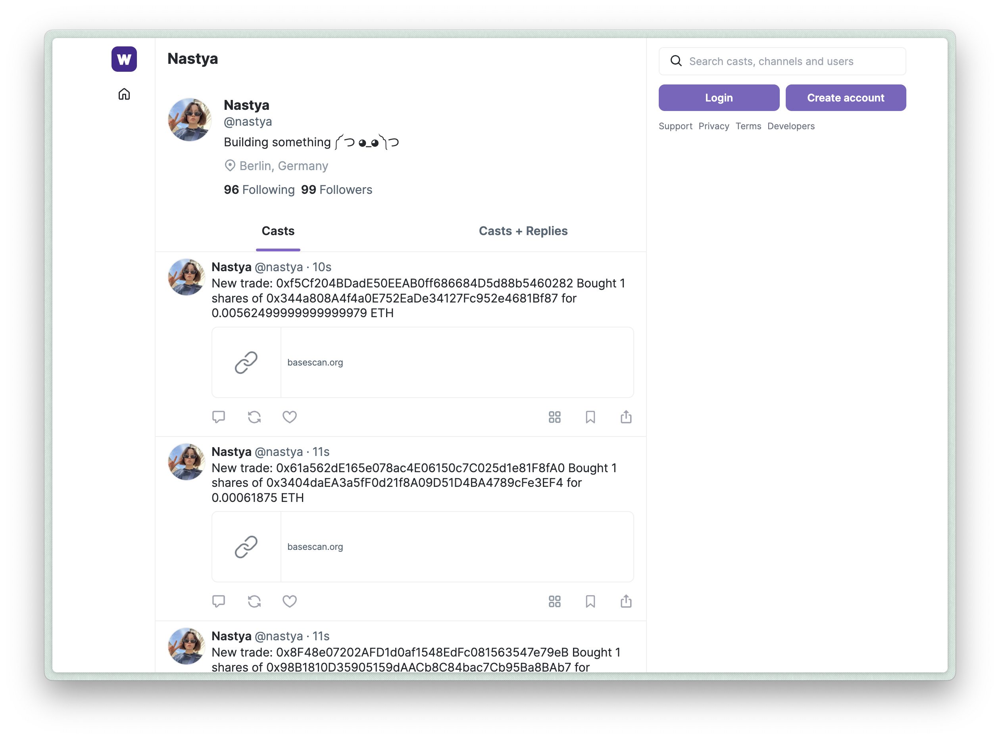
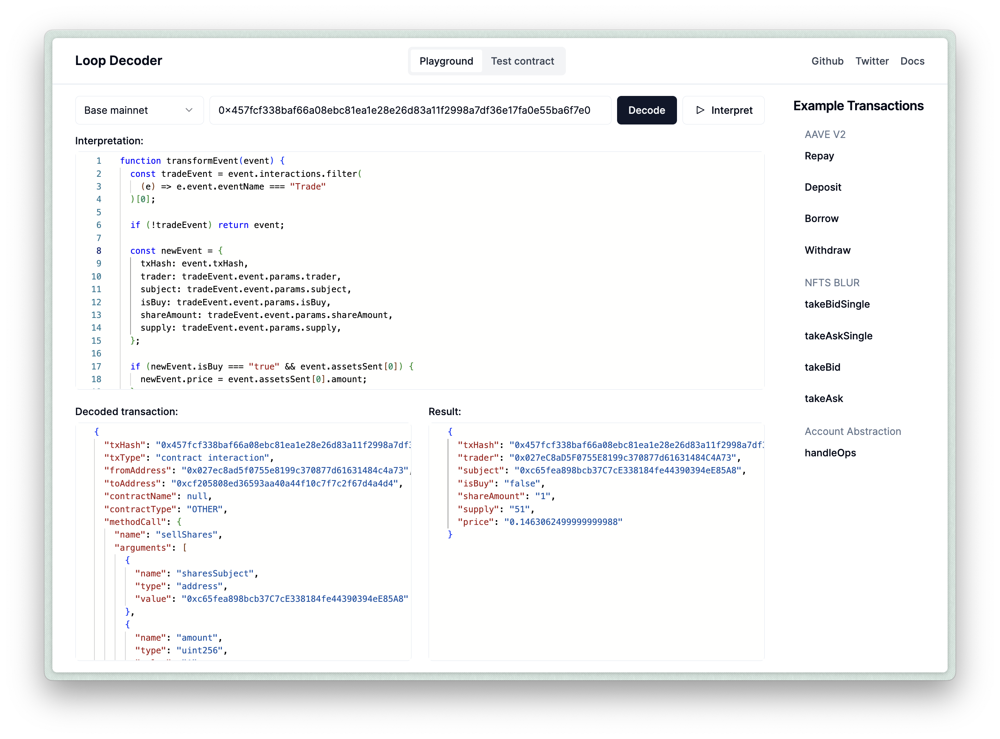

import { Content as MemoryAbiLoader } from '../../components/memory-abi-loader.md'
import { Content as MemoryContractLoader } from '../../components/memory-contract-loader.md'

import { Steps } from '@astrojs/starlight/components'

In this guide, you will learn how to create a Farcaster bot that sends human-readable alerts about transactions happening on-chain. You can customize this bot for any EVM-compatible blockchain, and you don't need any specific knowledge about EVM transaction decoding and interpretation.

:::tip
Jump to the repo to view the full code example [3loop/farcaster-onchain-alerts-bot](https://github.com/3loop/farcaster-onchain-alerts-bot)
:::

:::note
For the demo, we've used a [friend.tech](https://www.friend.tech) smart contract to track trading activity on the Base Mainnet network. By modifying the contract address and environment variables, you can create a bot to track smart contracts on any other EVM chain.
:::



## Guide

### Step 0: Prerequisites

- An installed Bun (see installation guide [here](https://bun.sh/docs/installation))
- An Alchemy account (sign up [here](https://www.alchemy.com/))
- An Etherscan(Basescan) account (sign up [here](https://basescan.org/register))
- A Farcaster account (can be yours or a separate one for your bot)

### Step 1: Clone the Repository

Clone the Bot [repository](https://github.com/3loop/farcaster-onchain-alerts-bot) and install project dependencies:

```bash
git clone https://github.com/3loop/farcaster-onchain-alerts-bot
cd farcaster-onchain-alerts-bot
bun i
```

### Step 2: Add Etherescan and Alchemy API Keys

Copy and rename the `.env.example` file to `.env`, then paste the Alchemy and Etherescan API keys into the `ALCHEMY_API_KEY` and `ETHERSCAN_API_KEY` variables.

```bash
cp .env.example .env
vim .env
```

To reproduce the Friend.tech alerts bot, you need to create an Alchemy App for the Base Mainnet and get an API key from the Basescan. We use the Alchemy API key to monitor new transactions, and the Etherscan API key (from the free plan) to fetch contract ABIs and avoid hitting rate limits. The Etherscan API could be optional if the transactions you are interested in do not interact with many contracts.

### Step 3: Create a Farcaster Account Key (Signer)

A Farcaster signer is a separate Ed25519 public and private key pair connected to your Farcaster account that you need for posting messages on your behalf. To connect the key pair, you have to send a transaction from your Farcaster wallet to the Key Registry Farcaster smart contract. At the moment of writing this guide, there was no simple way to create and connect the signer without using 3rd party APIs. So we made a script to generate the required transaction, and to run it you need to do the following:

<Steps>

1. **Fund your Farcaster custody wallet on Optimism:**: You need some ETH on the Optimism chain to pay for the gas. A few dollars would be enough. Click on the 3 dots near your profile, press "About," and there you will find your custody address.
2. **Get your Farcaster recovery phrase**: On your phone, go to settings -> advanced -> recovery phrase, and write this recovery phrase into the `MNEMONIC` variable in the `scripts/create-signer.ts` file.
3. **Run the script**: Run the following command `bun run scripts/create-signer.ts`. The result of this script will be an Optimism transaction like [this](https://optimistic.etherscan.io/tx/0x9eecacefceb6f120c3ef50222eabb15d86fd5feac6dae3fdf09dccb7687c70d4), and a public and private key printed in the console. Do not share the private key.
4. **Add env variables**: Add the private key generated from the script and the bot's account FID into the `SIGNER_PRIVATE_KEY` and `ACCOUNT_FID` variables.

</Steps>

### Step 4: Setup the Decoder

Now, let's go through the code. To begin using the Loop Decoder, we need to set up the following components:

#### RPC Provider

We'll create a function that returns an object with a`PublicClient` based on the chain ID. In this example, we are going to support the Base Mainnet.

The `constants.ts` file contains the RPC URL and configuration. The Base RPCs do not support a trace API, so we need to specify it in the configuration:

```ts title="src/constants.ts"
export const RPC = {
  8453: {
    // Transaciton decoder by default needs archive node for transaction tracing
    // becasue Alchemy free plan does not provide archive nodes, we use a different RPC here
    archiveUrl: process.env.ARCHIVE_RPC_URL,

    // Provide "none" when transaciton tracing is not needed
    traceAPI: 'geth',
  },
}
```

The `getPublicClient` returns an RPC client based on the chaind ID and the config from `constants.ts`:

```ts title="src/decoder/decoder.ts"
import { createPublicClient } from 'viem'

const getPublicClient = (chainId: number) => {
  const rpc = RPC[chainId as keyof typeof RPC]
  if (!rpc) throw new Error(`Missing RPC provider for chain ID ${chainId}`)

  return {
    client: createPublicClient({ transport: http(rpc.archiveUrl) }),
    config: { traceAPI: rpc.traceAPI },
  }
}
```

#### ABI Loader

To avoid making unecessary calls to third-party APIs, Loop Decoder uses an API that allows cache. For this example, we will keep it simple and use an in-memory cache. We will also use some strategies to download contract ABIs from Etherscan and 4byte.directory. You can find more information about the strategies in the [Strategies](/reference/data-loaders/) reference.

Create a cache for contract ABI:

<MemoryAbiLoader />

#### Contract Metadata Loader

Create an in-memory cache for contract meta-information. Using `ERC20RPCStrategyResolver` we will automatically retrieve token meta information from the contract such as token name, decimals, symbol, etc.

<MemoryContractLoader />

#### Loop Decoder instance

Finally, we'll create a new instance of the LoopDecoder class.

```ts title="src/decoder/decoder.ts"
import { TransactionDecoder } from '@3loop/transaction-decoder'

const decoder = new TransactionDecoder({
  getPublicClient: getPublicClient,
  abiStore: abiStore,
  contractMetaStore: contractMetaStore,
})
```

### Step 5: Decode and Interpret a Transaction

After creating the `decoder` object in the `decoder.ts` file, we can use its `decodeTransaction` method to decode transactions by hash:

```ts title="src/index.ts"
const decoded = await decoder.decodeTransaction({
  chainID: CHAIN_ID,
  hash: txHash,
})
```

The `decodeTransaction` method returns a `DecodedTransaction` object, which you can inspect using our [playground](https://loop-decoder-web.vercel.app/). [Here](https://loop-decoder-web.vercel.app/interpret/8453/0x3bc635e07e1cec2b73a896e6d130cffde6b3eeb419f91ea79028927fb7a66a07) is an example of the Friend.tech transaction.

To interpret a decoded transaction, the `interpreter.ts` file contains a `transformEvent` function that transforms the `DecodedTransaction` and adds an action description. You can test the `transformEvent` function by putting it into the Interpretation field on the playground with the Friend.tech [example](https://loop-decoder-web.vercel.app/tx/8453/0x3bc635e07e1cec2b73a896e6d130cffde6b3eeb419f91ea79028927fb7a66a07), and pressing "Interpret".



### Step 6: Create a Contract Subscription

The bot is set to monitor Friend.tech transactions on the Base Mainnet. The configuration variables are located in the `constants.ts` file:

```ts title="src/constants.ts"
export const CONTRACT_ADDRESS = '0xcf205808ed36593aa40a44f10c7f7c2f67d4a4d4'
export const CHAIN_ID = 8453
```

In the program's entry point, we start a WebSocket subscription for new transactions using Alchemy's WebSocket RPC.

```ts title="src/index.ts"
const wsClient = createPublicClient({
  transport: webSocket(ALCHEMY_WS_RPC_URL),
})

async function createSubscription(address: string) {
  await wsClient.transport.subscribe({
    method: 'eth_subscribe',
    params: [
      //@ts-ignore
      'alchemy_minedTransactions',
      {
        addresses: [{ to: address }],
        includeRemoved: false,
        hashesOnly: true,
      },
    ],
    onData: (data: any) => {
      const hash = data?.result?.transaction?.hash
      if (hash) handleTransaction(hash)
    },
    //...
  })
}

createSubscription(CONTRACT_ADDRESS)
```

### Step 7: Handle a new Transaction

The `handleTransaction` function is responsible for decoding incoming alerts and publishing them as Farcaster casts.

```ts title="src/index.ts"
async function handleTransaction(txHash?: string) {
  try {
    //...
    const decoded = await decoder.decodeTransaction({
      chainID: CHAIN_ID,
      hash: txHash,
    })

    if (!decoded) return
    const interpreted = interpretTx(decoded)

    const text = `New trade: ${interpreted.trader} ${interpreted.isBuy ? 'Bought' : 'Sold'} ${
      interpreted.shareAmount
    } shares of ${interpreted.subject} for ${interpreted.price} ETH`

    const message = { text: text, url: `${ETHERSCAN_ENDPOINT}/tx/${txHash}` }

    await publishToFarcaster(message)
  } catch (e) {
    console.error(e)
  }
}
```

#### Publishing to the Farcaster

We use the `@standard-crypto/farcaster-js-hub-rest` package to publish new casts to Farcaster. The `submitCast` function allows us to attach embeds like URLs or frames to the casts. We publish the casts in the bot's profile by including the bot's FID as the second argument.

```ts title="src/index.ts"
async function publishToFarcaster(cast: { text: string; url: string }) {
  //...
  const publishCastResponse = await client.submitCast(
    {
      text: cast.text,
      embeds: [
        {
          url: cast.url,
        },
      ],
    },
    Number(fid),
    signerPrivateKey,
  )
}
```

### Step 8: Start the Bot

Use the following command to start bot locally:

```bash
bun run src/index.ts
```

Your Farcaster bot is now set up and will monitor blockchain transactions and send casts to the bot's account.

## Conculsion

In this guide, you've learned how to create a Farcaster bot that monitors blockchain transactions and sends human-readable alerts. By using the Loop Decoder library, you can easily set up a bot to track specific contract addresses and chains without needing in-depth knowledge of EVM transaction decoding.

Let us know on X/Twitter ([@3loop_io](https://x.com/3loop_io)) if you encounter any problems or have any questions, we'd love to help you!

Happy coding!
