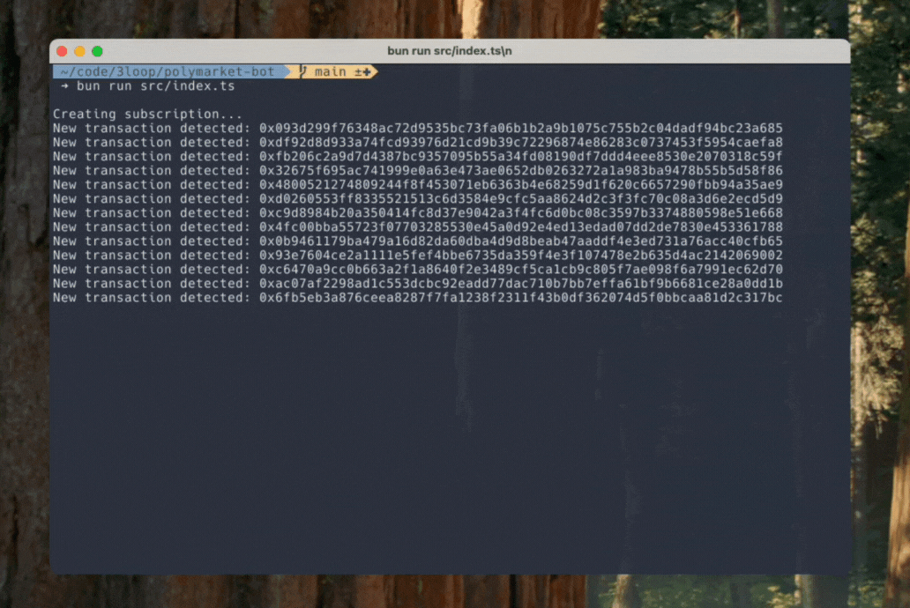

import { Content as MemoryAbiLoader } from '../../components/memory-abi-loader.md'
import { Content as MemoryContractLoader } from '../../components/memory-contract-loader.md'
import { Steps } from '@astrojs/starlight/components'

In this guide, you'll learn how to create a Polymarket bot that monitors Ethereum addresses directly on-chain and sends real-time human-readable alerts about Polymarket trades.

**What makes this approach powerful:**

- Monitor transactions directly via RPC WebSocket
- Decode and interpret transactions using only the transaction hash - no external APIs needed
- Get human-readable descriptions like "Bought 100 YES shares" automatically

:::tip
Jump to the repo to view the full code example [3loop/polymarket-bot](https://github.com/3loop/polymarket-bot)
:::



## Guide

### Step 0: Prerequisites

- Bun installed (see installation guide [here](https://bun.sh/docs/installation))
- Etherescan API Key (sign up [here](https://etherscan.io/))
- Polygon WebSocket RPC URL (you can get one from [Alchemy](https://www.alchemy.com/))
- (Optional) [Neynar](https://neynar.com/) API Key to publish messages on Farcaster

### Step 1: Clone the Repository

Clone the bot [repository](https://github.com/3loop/polymarket-bot) and install dependencies:

```bash
git clone https://github.com/3loop/polymarket-bot
cd polymarket-bot
bun i
```

### Step 2: Configure Environment Variables

Copy the `.env.example` file to `.env` and add your API keys:

```bash
cp .env.example .env
vim .env
```

For the Polymarket bot you need to specify the following keys:

- `RPC_URL` - Polygon mainnet RPC URL for transaction decoding (non-archive node is sufficient)
- `WS_RPC_URL` - WebSocket URL for real-time subscription (can be the same as `RPC_URL` with `wss` protocol if supported)
- `ETHERSCAN_API_KEY` - Etherescan V2 API key, used in transaction decoding to fetch and cache ABIs
- (optional) `NEYNAR_API_KEY` and `NEYNAR_SIGNER_UUID` - to resolve Polymarket wallet addresses and publish messages to Farcaster

### Step 3: Setup the Transaciton Decoder

Loop Decoder requires three components: an RPC provider, ABI store, and contract metadata store. Let's set up each one:

#### RPC Provider

Configure your RPC provider in `constants.ts` for Polygon Mainnet (chain ID 137). We set `traceAPI` to `'none'` since we do not use traces to understand Polymarket transactions in the interpretation:

```ts title="src/constants.ts"
export const RPC = {
  137: {
    url: process.env.RPC_URL,
    traceAPI: 'none',
  },
}
```

```ts title="src/decoder/decoder.ts"
export const getPublicClient = (chainId: number) => {
  const rpc = RPC[chainId as keyof typeof RPC]
  if (!rpc) throw new Error(`Missing RPC provider for chain ID ${chainId}`)

  return {
    client: createPublicClient({ transport: http(rpc.url) }),
    config: { traceAPI: rpc.traceAPI },
  }
}
```

#### ABI Store

Set up an in-memory ABI cache with Etherscan and 4byte.directory strategies:

<MemoryAbiLoader />

#### Contract Metadata Store

Set up contract metadata resolution for token or NFT information (name, decimals, symbol):

<MemoryContractLoader />

#### Create Decoder Instance

Combine all components into a `TransactionDecoder` instance:

```ts title="src/decoder/decoder.ts"
import { TransactionDecoder } from '@3loop/transaction-decoder'

export const decoder = new TransactionDecoder({
  getPublicClient,
  abiStore,
  contractMetaStore,
})
```

### Step 4: Setup the Transaciton Interpreter

:::note
The `@3loop/transaction-interpreter` package is in Beta. You can copy the utility functions directly into your project if preferred.
:::

The interpreter converts `DecodedTransaction` into human-readable descriptions. Here's the implementation in `src/decoder/interpreter.ts`:

```ts title="src/decoder/interpreter.ts"
import { getInterpreter, fallbackInterpreter } from '@3loop/transaction-interpreter'

export async function interpretTransaction(decodedTx: DecodedTransaction, userAddress?: string) {
  // Find the right interpreter for this transaction
  const interpreter = getInterpreter(decodedTx) ?? fallbackInterpreter

  // Configure for Polymarket (needs off-chain data fetching)
  const config = Layer.succeed(QuickjsConfig, {
    variant: variant,
    runtimeConfig: {
      timeout: 5000,
      useFetch: true, // Required for Polymarket market data
    },
  })

  // Apply the interpreter
  const layer = Layer.provide(QuickjsInterpreterLive, config)
  const runnable = Effect.gen(function* () {
    const service = yield* TransactionInterpreter
    return yield* service.interpretTransaction(decodedTx, interpreter, {
      interpretAsUserAddress: userAddress, // Get user's perspective (bought vs sold)
    })
  }).pipe(Effect.provide(layer))

  return Effect.runPromise(runnable)
}
```

The `userAddress` parameter is important - it determines the transaction direction from the user's perspective (e.g., "bought" vs "sold" shares).

### Step 5: Decode and Interpret Transactions

With the decoder set up, you can now decode transactions and make them human-readable. Here's how it works:

```ts title="src/index.ts"
// 1. Decode the transaction
const decoded = await decoder.decodeTransaction({
  chainID: CHAIN_ID,
  hash: txHash,
})

// 2. Interpret it (make it human-readable)
const interpreted = await interpretTransaction(decoded, userAddress)

// 3. Use the result
console.log(interpreted.action) // e.g., "Bought 100 YES shares in market 'Will Trump win?'"
```

View a [decoded transaction example](https://loop-decoder-web.vercel.app/interpret/137/0xe1429321d4d89f85126d346b01797e7b20b86ba6ea1d53e6c2b782ea46df4247) in our playground.

### Step 6: Monitor Polymarket Transactions

Now let's set up real-time monitoring for Polymarket `OrderFilled` events:

```ts title="src/constants.ts"
export const POLYMARKET_EXCHANGE_ADDRESS = '0x4bfb41d5b3570defd03c39a9a4d8de6bd8b8982e'
export const CHAIN_ID = 137
```

```ts title="src/index.ts"
// List of Polymarket user addresses to track
const ADDRESSES_TO_TRACK = ['0xca85f4b9e472b542e1df039594eeaebb6d466bf2']

// Subscribe to OrderFilled events
wsClient.watchEvent({
  address: POLYMARKET_EXCHANGE_ADDRESS,
  event: ORDER_FILLED_EVENT_ABI,
  args: {
    maker: ADDRESSES_TO_TRACK,
  },
  onLogs: (logs) => {
    logs.forEach((log) => {
      handleTransaction(log.transactionHash, log.args.maker)
    })
  },
})

// Process each transaction
async function handleTransaction(txHash: string, userAddress: string) {
  // 1. Decode
  const decoded = await decoder.decodeTransaction({
    chainID: CHAIN_ID,
    hash: txHash,
  })

  // 2. Interpret from user's perspective
  const interpreted = await interpretTransaction(decoded, userAddress)

  // 3. Create message
  const message = {
    action: interpreted.action,
    txHash,
    userAddress,
  }
}
```

### Step 7: (Optional) Publish to Farcaster

If you configured Neynar API keys, you can resolve Farcaster usernames and publish alerts:

```ts title="src/index.ts"
async function publishToFarcaster(message: { action: string; txHash: string; userAddress: string }) {
  const farcasterUser = await resolveFarcasterUser(message.userAddress)

  const castText = farcasterUser ? `@${farcasterUser.username} ${message.action}` : `${message.action}`

  await neynarClient.publishCast({
    text: castText,
    embeds: [{ url: `https://polygonscan.com/tx/${message.txHash}` }],
  })
}
```

### Step 8: Run the Bot

Start the bot locally:

```bash
bun run src/index.ts
```

The bot will now monitor Polymarket transactions for your tracked addresses and publish human-readable alerts to Farcaster.

## Next Steps

You've built a Polymarket bot that:

- Monitors specific addresses in real-time from the blockchain directly
- Decodes Polymarket transactions
- Generates human-readable descriptions
- Posts alerts to Farcaster

**Customize it further:**

- Track different Polymarket addresses by updating `ADDRESSES_TO_TRACK`
- Modify the message format in `publishToFarcaster`
- Add filters for specific market types or trade sizes
- Deploy to a server for 24/7 monitoring

---

Need help? Reach out on X/Twitter [@3loop_io](https://x.com/3loop_io) or check the [full code example](https://github.com/3loop/polymarket-bot).
