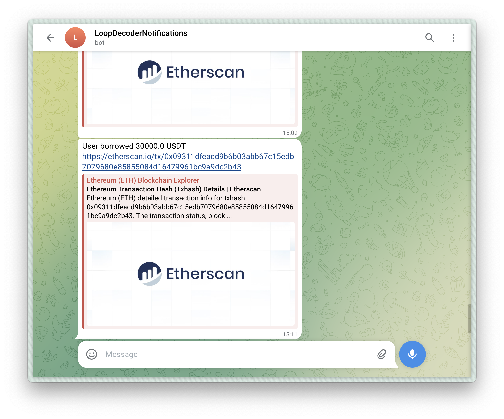

import { Content as MemoryAbiLoader } from '../../components/memory-abi-loader.md'
import { Content as MemoryContractLoader } from '../../components/memory-contract-loader.md'
import { Content as RpcProvider } from '../../components/rpc-provider.md'

In this guide, you will learn how to create a Telegram bot that sends human-readable alerts about transactions happening on-chain. You can customize this bot for any EVM-compatible blockchain, and you don't need any specific knowledge about EVM transaction decoding and interpretation.

:::tip
Jump to the repo to view the full code example [3loop/example-tg-bot](https://github.com/3loop/example-tg-bot)
:::



## Guide

### Step 0: Prerequisites

- Bun installed (see installation guide [here](https://bun.sh/docs/installation))
- Alchemy account (sign up [here](https://www.alchemy.com/))
- Etherscan API Key (sign up [here](https://etherscan.io/register))
- Telegram account

### Step 1: Clone the Repository

Clone the bot [repository](https://github.com/3loop/example-tg-bot) and install dependencies:

```bash
git clone https://github.com/3loop/example-tg-bot
cd example-tg-bot
bun i
```

### Step 2: Configure Environment Variables

Copy the `.env.example` file to `.env` and add your API keys:

```bash
cp .env.example .env
vim .env
```

For the Telegram bot you need to specify:

- `ALCHEMY_API_KEY` - Alchemy API key to monitor new transactions via WebSocket
- `ETHERSCAN_API_KEY` - Etherscan API key, used to fetch and cache ABIs
- `TELEGRAM_BOT_TOKEN` and `TELEGRAM_CHAT_ID` - Telegram bot credentials (see Step 3)

### Step 3: Create a New Bot on Telegram

1. **Obtain a bot token**: Start a chat with the [BotFather](https://t.me/BotFather) bot in Telegram, write `/newbot` into the chat, follow the instructions, and copy the bot token. Paste its value into the `TELEGRAM_BOT_TOKEN` variable in the `.env` file.
2. **Obtain a chat ID**: Get the chat ID of the chat where the bot should send notifications. Start a chat with your bot by pressing the `/start` command. Then open to the link `https://api.telegram.org/bot<YourBOTToken>/getUpdates`, where `YourBotToken` is the token you copied from the BotFather. From the `chat` object, copy the `id` and put it into the `TELEGRAM_CHAT_ID` variable in the `.env` file. Check this [StackOverflow answer](https://stackoverflow.com/a/32572159) for more details.

### Step 4: Setup the Transaction Decoder

Loop Decoder requires three components: an RPC provider, ABI store, and contract metadata store. Let's set up each one:

#### RPC Provider

Configure your RPC provider in `constants.ts` for Ethereum Mainnet (chain ID 1):

```ts title="src/constants.ts"
export const RPC = {
  1: {
    url: `wss://eth-mainnet.g.alchemy.com/v2/${process.env.ALCHEMY_API_KEY}`,
  },
}
```

<RpcProvider />

#### ABI Store

Set up an in-memory ABI cache with Etherscan and 4byte.directory strategies:

<MemoryAbiLoader />

#### Contract Metadata Store

Set up contract metadata resolution for token or NFT information (name, decimals, symbol):

<MemoryContractLoader />

#### Create Decoder Instance

Combine all components into a `TransactionDecoder` instance:

```ts title="src/decoder/decoder.ts"
import { TransactionDecoder } from '@3loop/transaction-decoder'

const decoder = new TransactionDecoder({
  getPublicClient,
  abiStore,
  contractMetaStore,
})
```

### Step 5: Decode and Interpret Transactions

With the decoder set up, you can now decode transactions and make them human-readable:

```ts title="src/index.ts"
// 1. Decode the transaction
const decoded = await decoder.decodeTransaction({
  chainID: CHAIN_ID,
  hash: txHash,
})

// 2. Interpret it (make it human-readable)
const interpreted = interpretTx(decoded)

// 3. Use the result
console.log(interpreted.action) // e.g., "Supplied 1000 USDC to AAVE V3"
```

View a [decoded AAVE V3 transaction example](https://loop-decoder-web.vercel.app/interpret/1/0xb8a923541802ea5017ddccd2c1047dd16ce22048630c1c619b19fdb799b690dd) in our playground. You can test the `interpretTx` function by pasting it into the Interpretation field.


### Step 6: Monitor AAVE V3 Transactions

Set up real-time monitoring for AAVE V3 transactions. Update the contract address in `constants.ts`:

```ts title="src/constants.ts"
export const CONTRACT_ADDRESS = '0x87870Bca3F3fD6335C3F4ce8392D69350B4fA4E2'
export const CHAIN_ID = 1
```

Subscribe to new transactions and process them:

```ts title="src/index.ts"
// Subscribe to AAVE V3 transactions
publicClient.transport.subscribe({
  method: 'eth_subscribe',
  params: [
    'alchemy_minedTransactions',
    {
      addresses: [{ to: CONTRACT_ADDRESS }],
      includeRemoved: false,
      hashesOnly: true,
    },
  ],
  onData: (data: any) => {
    const hash = data?.result?.transaction?.hash
    if (hash) handleTransaction(hash)
  },
})

// Process each transaction
async function handleTransaction(txHash: string) {
  try {
    // 1. Decode
    const decoded = await decoder.decodeTransaction({
      chainID: CHAIN_ID,
      hash: txHash,
    })

    if (!decoded) return

    // 2. Interpret
    const interpreted = interpretTx(decoded)

    if (!interpreted.action) {
      console.log('No defined action for this transaction.', txHash)
      return
    }

    // 3. Send to Telegram
    const botMessage = `${interpreted.action}\nhttps://etherscan.io/tx/${txHash}`
    bot.sendMessage(chatId, botMessage)
  } catch (e) {
    console.error(e)
  }
}
```

### Step 7: Run the Bot

Start the bot locally:

```bash
bun run src/index.ts
```

The bot will now monitor AAVE V3 transactions and send alerts to your Telegram chat.

## Next Steps

You've built a Telegram bot that:

- Monitors specific contracts in real-time
- Decodes transactions automatically
- Generates human-readable descriptions
- Sends alerts to Telegram

**Customize it further:**

- Track different contracts by updating `CONTRACT_ADDRESS`
- Modify the message format in `handleTransaction`
- Add filters for specific transaction types or amounts
- Deploy to a server for 24/7 monitoring

---

Need help? Reach out on X/Twitter [@3loop_io](https://x.com/3loop_io) or check the [full code example](https://github.com/3loop/example-tg-bot).
