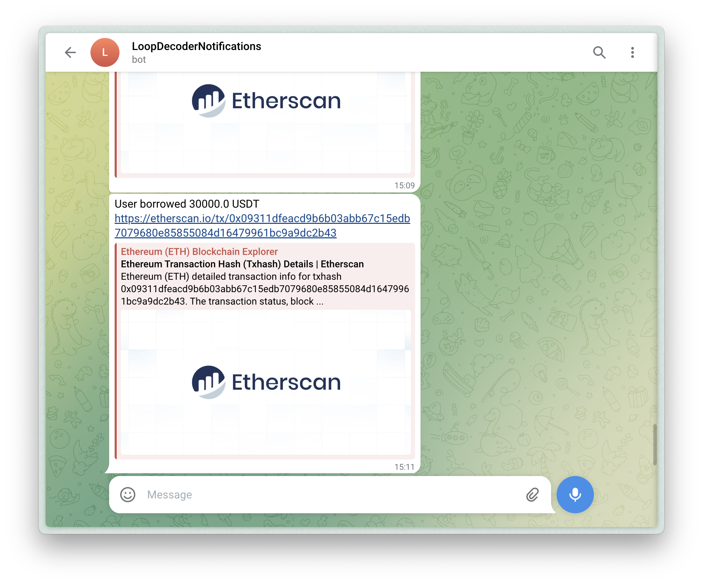
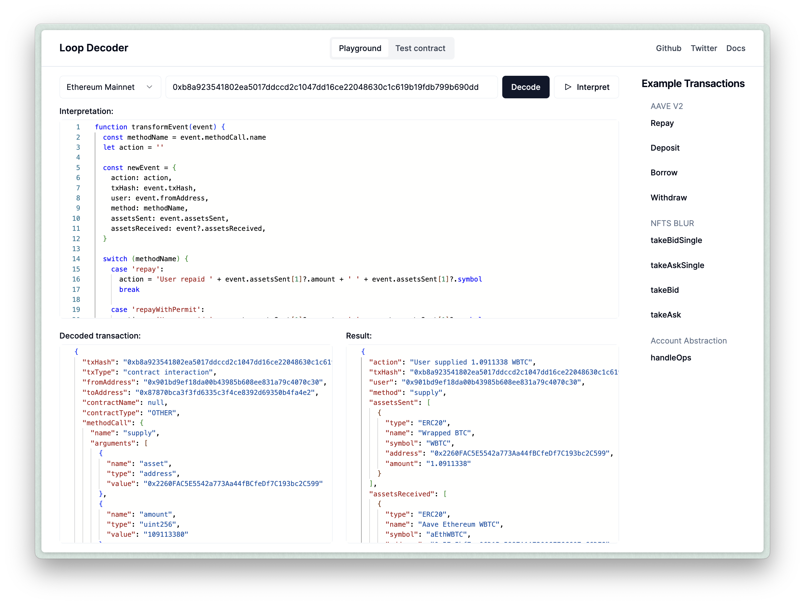

In this guide, you will learn how to create a Telegram bot that sends human-readable alerts about transactions happening on-chain. You can customize this bot for any EVM-compatible blockchain, and you don't need any specific knowledge about EVM transaction decoding and interpretation.



## Guide

### Step 0: Prerequisites

- An installed NodeJS
- An Alchemy account (sign up [here](https://www.alchemy.com/))
- An Etherscan account (sign up [here](https://etherscan.io/register))
- A Telegram account

### Step 1: Clone the Repository

Clone the Bot [repository](https://github.com/3loop/example-tg-bot) from GitHub and install project dependecies:

```bash
git clone https://github.com/3loop/example-tg-bot
cd example-tg-bot
pnpm i
```

### Step 2: Set Up the Decoder

To begin using the Loop Decoder, we need to set up the following components:

#### RPC Provider

We'll create a function that returns an object with a `PublicClient` based on the chain ID. For this example, we'll only support the Ethereum mainnet.

```ts
import { createPublicClient, http } from 'viem'

const getPublicClient = (chainId: number) => {
  //...

  return {
    client: createPublicClient({
      transport: http('https://rpc.ankr.com/eth'),
    }),
  }
}
```

#### ABI Loader

We'll use an in-memory cache and strategies to download contract ABIs from Etherscan and 4byte.directory. Note that we pass the `EtherscanStrategyResolver` the `ETHERSCAN_API_KEY` environment variable, which we'll explain how to setup in [Step 6](#step-6-add-etherescan-and-alchemy-api-keys).

```ts
import { EtherscanStrategyResolver, FourByteStrategyResolver } from '@3loop/transaction-decoder'

const abiCache = new Map<string, string>()

const abiStore = {
  strategies: [
    EtherscanStrategyResolver({
      apikey: process.env.ETHERSCAN_API_KEY || '',
    }),
    FourByteStrategyResolver(),
  ],
  get: async (req: { address: string }) => {
    return Promise.resolve(abiCache.get(req.address.toLowerCase()) ?? null)
  },
  set: async (req: { address?: Record<string, string> }) => {
    const addresses = Object.keys(req.address ?? {})

    addresses.forEach((address) => {
      abiCache.set(address.toLowerCase(), req.address?.[address] ?? '')
    })
  },
}
```

#### Contract Metadata Loader

We'll create an in-memory cache for contract meta-information. Using `ERC20RPCStrategyResolver` we will automatically retrieve token meta information from the contract such as token name, decimals, symbol, etc.

```ts
import type { ContractData } from '@3loop/transaction-decoder'
import { ERC20RPCStrategyResolver } from '@3loop/transaction-decoder'

const contractMetaCache = new Map<string, ContractData>()

const contractMetaStore = {
  strategies: [ERC20RPCStrategyResolver],
  get: async (req: { address: string }) => {
    return contractMetaCache.get(req.address.toLowerCase()) ?? null
  },
  set: async (req: { address: string }, data: ContractData) => {
    contractMetaCache.set(req.address.toLowerCase(), data)
  },
}
```

#### Loop Decoder instance

Finally, we'll create a new instance of the LoopDecoder class.

```ts
import { TransactionDecoder } from '@3loop/transaction-decoder'

const decoder = new TransactionDecoder({
  getPublicClient: getPublicClient,
  abiStore: abiStore,
  contractMetaStore: contractMetaStore,
})
```

### Step 3: Decode and Interpret a Transaction

After creating the `decoder` object in the `decoder.ts` file, we can use its `decodeTransaction` method to decode transactions by hash:

```ts
const decoded = await decoder.decodeTransaction({
  chainID: chainID,
  hash: txHash,
})
```

The `decodeTransaction` method returns a `DecodedTx` object, which you can inspect using our [playground](https://loop-decoder-web.vercel.app/). [Here](https://loop-decoder-web.vercel.app/tx/1/0xb8a923541802ea5017ddccd2c1047dd16ce22048630c1c619b19fdb799b690dd) is an example of an AAVE V3 transaction.

To interpret a decoded transaction, the `interpreter.ts` file contains a `transformEvent` function that transforms the `DecodedTx` and adds an action description. You can test the `transformEvent` function by putting it into the Interpretation field on the playground with the AAVE V3 [example](https://loop-decoder-web.vercel.app/tx/1/0xb8a923541802ea5017ddccd2c1047dd16ce22048630c1c619b19fdb799b690dd), and pressing "Interpret".



### Step 4: Create a Contract Subscription

The bot is set to monitor AAVE V3 transactions on the Ethereum mainnet by default. Update the contract address and chain ID in the `index.ts` file:

```ts title="src/index.ts"
const contractAddress = '0x87870Bca3F3fD6335C3F4ce8392D69350B4fA4E2'
const chainID = 1
```

In the same file, we start a server and create a WebSocket subscription for new transactions using the Alchemy SDK:

```ts
function createSubscription(address: string) {
  alchemy.ws.on()
  //...
}

const fastify = Fastify({ logger: true })

fastify.listen({ port: 3000 }, async (err, address) => {
  if (err) throw err
  console.log(`Server listening on ${address}`)
  createSubscription(contractAddress)
})
```

### Step 5: Handle a new Transaction

The `handleTransaction` function is responsible for decoding incoming alerts and sending a Telegram message. You can customize the bot message or add extra information by tweaking the botMessage variable.

```ts
async function handleTransaction(txHash?: string) {
  try {
    //...

    const decoded = await decodeTx(txHash);
    if (!decoded) return;

    const interpreted = interpretTx(decoded as DecodedTx);

    if (!interpreted.action) {
      console.log("No defined action for this transaction.", txHash);
      return;
    }
    const botMessage = `${interpreted.action} <https://etherscan.io/tx/${txHash}`>;
    bot.sendMessage(chatId, botMessage);
  } catch (e) {
    console.error(e);
  }
}

```

### Step 6: Add Etherescan and Alchemy API keys

Copy and rename the `.env.example` file to `.env`, then paste the Alchemy and Etherescan API keys into the `ALCHEMY_API_KEY` and `ETHERSCAN_API_KEY` variables.

```bash
cp .env.example .env
vim .env
```

We use the Alchemy API key to monitor new transactions happening on the blockchain, and the Etherscan API key (from the free plan) to fetch contract ABIs and avoid hitting rate limits. The Etherscan API could be optional if the transactions you are interested in do not interact with many contracts, but since we are testing AAVE V3 it will have many interactions.

### Step 7: Create a New Bot on Telegram

1. **Obtain a bot token**: Start a chat with the [BotFather](https://t.me/BotFather) bot in Telegram, write `/newbot` into the chat, follow the instructions, and copy the bot token. Paste its value into the `TELEGRAM_BOT_TOKEN` variable in the `.env` file.
2. **Obtain a chat ID**: Get the chat ID of the chat where the bot should send notifications. Start a chat with your bot by pressing the `/start` command. Then open to the link `https://api.telegram.org/bot<YourBOTToken>/getUpdates`, where `YourBotToken` is the token you copied from the BotFather. From the `chat` object, copy the `id` and put it into the `TELEGRAM_CHAT_ID` variable in the `.env` file. Check this [StackOverflow answer](https://stackoverflow.com/a/32572159) for more details.

### Step 8: Start the Bot

Use the following command to start the server locally:

```bash
pnpm start
```

Your Telegram bot is now set up and will monitor blockchain transactions and send alerts to the specified chat or channel.

## Conculsion

In this guide, you've learned how to create a Telegram bot that monitors blockchain transactions and sends human-readable alerts. By using the Loop Decoder library, you can easily set up a bot to track specific contract addresses and chains without needing in-depth knowledge of EVM transaction decoding.

Let us know on X/Twitter ([@3loop_io](https://x.com/3loop_io)) if you encounter any problems or have any questions, we'd love to help you!

Happy coding!
