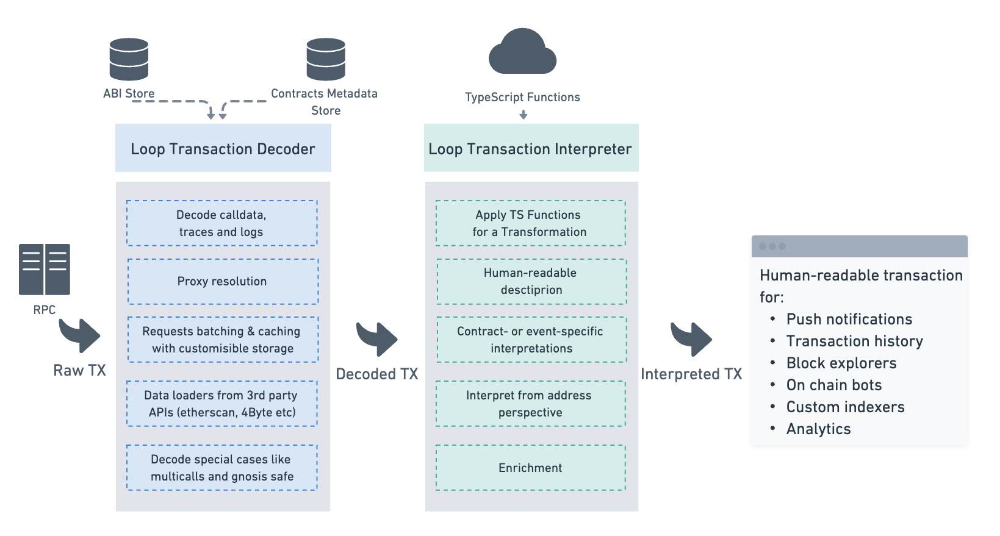
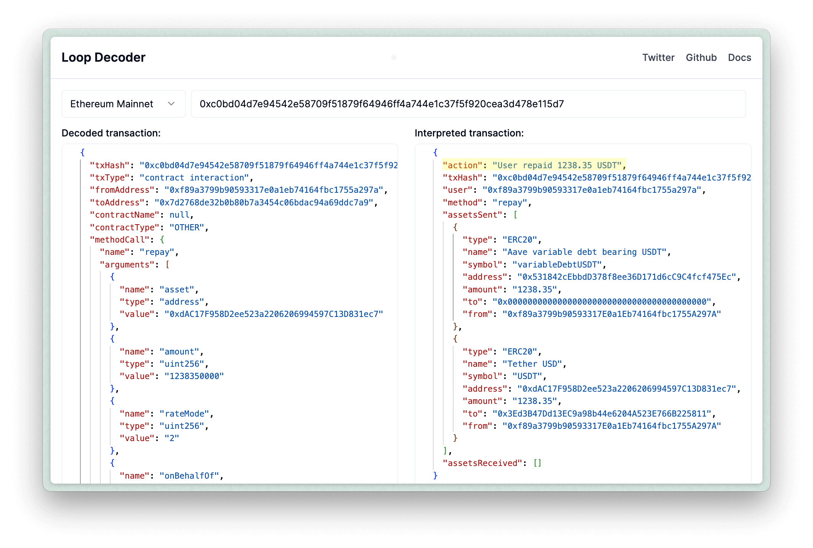

## Introduction

Loop Decoder is a TypeScript library with minimal dependencies that transforms blockchain data into a human-readable format. We designed it with these key goals in mind:

- Work in any JavaScript environment
- Minimal external dependencies - you only need an RPC; everything else can be fetched from your own storage.
- Highly customizable - we don't force you to use a specific API or storage; instead, we provide composable and customizable modules.

### Transaction Decoder

The Transaction Decoder package transforms raw transactions, including calldata, traces, and events, into a structured format with detailed information about all function calls and parameters. The decoded transaction includes the following:

- Method calls
- Trace calls
- Events
- All transfers
- Interactions with other contracts
- Error information

See the Decoded Transaction section in our [playground](https://loop-decoder-web.vercel.app/) for transaction examples.

The minimal configuration for the Transaction Decoder requires an RPC URL, ABIs, and contract metadata stores, which can be in-memory (see the [Data Store](/reference/data-store/) section). We also provide data loaders for popular APIs like Etherscan (see the full list in the [ABI Strategies](/reference/data-loaders/) section). These loaders request contract metadata and cache it in your specified store. The decoder supports RPCs with both Debug (Geth tracers) and Trace (OpenEthereum/Parity and Erigon tracers) APIs.

### Transaction Interpreter

Transaction Interpretation allows you to understand what really happened in any transaction. In Loop Decoder, this is a JavaScript function that takes a Decoded Transaction and selects the most important fields and parameters based on the type of contract interacted with.

:::caution
The Transaction Interpreter is still under development and breaking changes are expected.
:::

For example, the interpretation can construct a one-line description of the transaction:

Our goal is to create these interpretations for the most popular types of contracts, enabling developers to build performant and user-friendly interfaces for their dApps, without relying on third-party APIs where you can't control the data format. We also aim to make it easy to write your own interpretations if you need them only for your contracts.

See our [Contribution Guide](/contribution/) to learn more about how to contribute to interpretations.
